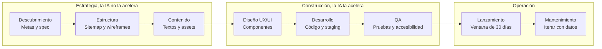
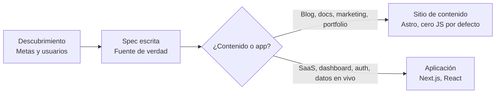
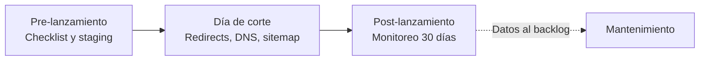

# Proceso de creación de una web

Referencia del proceso que sigue web-lab para hacer una web, desde un sitio estático hasta una
app. Es la base sobre la que se construyen los skills y agentes del repo: cada fase tendrá su
propio skill y Claude Code actúa como orquestador entre ellas.

## Resumen

El proceso es una secuencia de ocho fases con un checkpoint de aprobación de Yuno entre cada
una. Lo que cambió en 2026 es el reparto del tiempo: la IA comprimió las fases del medio,
diseño visual y código, pero el descubrimiento y el QA duran lo mismo y siguen decidiendo la
calidad del resultado.

La práctica base es *spec-driven development*: la fase 1 termina en una especificación escrita
y versionada que es la fuente de verdad. De ella salen el plan, las tareas y solo al final el
código. El "vibe coding" queda para prototipos desechables.

## Flujo completo

Cada flecha es un checkpoint: no se pasa a la siguiente fase sin aprobación explícita. Las
fases 2 y 3 corren en paralelo.

## Fase 1: de la spec a la decisión de arquitectura

La spec y el stack elegido alimentan las fases 2 a 8. Un proyecto híbrido usa ambos: marketing
en Astro, producto en Next.js.

## Ventana de lanzamiento

El lanzamiento no es un clic. Es una ventana de unos 30 días con endurecimiento previo, día de
corte y monitoreo posterior.

## Fases, entregables y checkpoints

| # | Fase | Entregables | Checkpoint | Rol |
|---|------|-------------|------------|----------------|
| 1 | Descubrimiento | Brief: objetivos, audiencia, tareas del usuario, competencia, métricas, restricciones. Spec escrita. Decisión contenido vs. app. | Aprobar metas, métricas y stack antes de diseñar | `cooper` + `schneier` |
| 2 | Estructura | Sitemap, jerarquía de páginas, intención por página, wireframes de plantillas clave | Firmar la estructura para evitar retrabajo | `rosenfeld` |
| 3 | Contenido | Mensajes por página, secciones, lista de assets (fotos, video, iconos), alineación SEO | Dirección de contenido aprobada antes del diseño visual | `rosenfeld` |
| 4 | Diseño UX/UI | Sistema de componentes, reglas responsive, estados, accesibilidad documentada, prototipo | QA de diseño incluyendo comportamiento en móvil | `frost` |
| 5 | Desarrollo | Código con Core Web Vitals en mente, CMS si aplica, contenido integrado en staging | Revisión de staging: rendimiento, accesibilidad, contenido | `osmani`, `hopper` (apps), `bellard` (medios) |
| 6 | QA | Funcional, navegadores y dispositivos, rendimiento, accesibilidad automática y manual | Reporte de pruebas y checklist pre-lanzamiento verificado | `beizer` + `schneier` |
| 7 | Lanzamiento | Checklist ejecutado, mapa de redirects 301, analítica validada, sitemap en Search Console | Go-live con firma de Schneier | `allspaw` + `schneier` |
| 8 | Mantenimiento | Plan de mantenimiento, dueño del contenido, iteración con datos | Revisión periódica | `allspaw` |

Duración típica: de 4 a 6 semanas para un sitio pequeño, 8 a 13 semanas para un sitio de
marketing de 10 a 15 páginas con CMS.

## Estándares mínimos

- Core Web Vitals: LCP ≤ 2.5 s, INP ≤ 200 ms, CLS ≤ 0.1.
- Accesibilidad: WCAG 2.2 AA. Las herramientas automáticas atrapan solo entre 30 y 40 % de los
  problemas; el resto es revisión manual.
- Estilos: Tailwind v4 con tokens de diseño. Figma como origen del diseño; Code Connect emite
  componentes React y Next.js.
- Despliegue: Vercel o Netlify, en edge.
- QA continuo: pruebas de regresión y unitarias corren durante el desarrollo, no al final.

## Roles y seguridad

Cada fase tiene un rol en [`agents/`](../agents/) y el orquestador los coordina según
[`CLAUDE.md`](../CLAUDE.md). **Schneier**, el rol de seguridad, revisa al cierre de cada fase
con la checklist de [`SEGURIDAD.md`](SEGURIDAD.md): un hallazgo crítico bloquea el paso de
fase y uno alto bloquea el lanzamiento. Los skills con procedimiento y plantillas se van
sumando fase por fase: [`discovery`](../skills/discovery/SKILL.md) para la fase 1,
[`structure`](../skills/structure/SKILL.md) para la fase 2,
[`content`](../skills/content/SKILL.md) para la fase 3,
[`design-system`](../skills/design-system/SKILL.md) para la fase 4,
[`build`](../skills/build/SKILL.md) para la fase 5,
[`qa`](../skills/qa/SKILL.md) para la fase 6,
[`launch`](../skills/launch/SKILL.md) para las fases 7 y 8, y
[`optimize-assets`](../skills/optimize-assets/SKILL.md) para medios en las fases 5 y 6.

## Fuentes

- [Web Design Agency Process: Discovery to Launch (2026) | Brand Vision](https://www.brandvm.com/post/web-design-agency-2026)
- [The Web Design Process: 8 Essential Steps (2026) | UXPin](https://www.uxpin.com/studio/blog/web-design-process/)
- [Modern Web App Development Process (2026) | Techloy](https://www.techloy.com/modern-web-app-development-process-2026-from-planning-to-ai-driven-deployment/)
- [Web Development Process: 6 Steps (2026) | Webandcrafts](https://webandcrafts.com/blog/website-development-process)
- [The 7-Step Website Development Process (2026) | Digital Silk](https://www.digitalsilk.com/web-development/development-trends/website-development-process/)
- [Web Design Process: What to Expect From an Agency | Brambla](https://www.brambla.co.uk/blog/web-design-process-explained/)
- [Next.js vs. Astro in 2026 | Vercel](https://vercel.com/i/astro-vs-next-js)
- [Astro vs Next.js: Content Sites vs Full-Stack Apps in 2026 | Out Plane](https://outplane.com/blog/astro-vs-nextjs)
- [Complete Web Design Workflow for 2026 | Medium](https://medium.com/@elaissiilyas/complete-web-design-workflow-for-2026-77ab228145ca)
- [Web Development in 2026: Trends, Technologies, and Workflows | Hippotool](https://hippotool.com/web-development-in-2026/)
- [Spec-Driven Development: The Definitive 2026 Guide | BCMS](https://www.thebcms.com/blog/spec-driven-development/)
- [Spec-driven development | Thoughtworks](https://www.thoughtworks.com/en-us/insights/blog/agile-engineering-practices/spec-driven-development-unpacking-2025-new-engineering-practices)
- [Website Launch Checklist: The 2026 Guide | Trajectory](https://www.trajectorywebdesign.com/blog/website-launch-checklist/)
- [Website Launch Checklist 2026: 150+ Items | Digital Applied](https://www.digitalapplied.com/blog/website-launch-checklist-150-items-2026)
- [Website launch checklist: your complete 2026 guide | done.lu](https://done.lu/website-launch-checklist-your-complete-2026-guide/)
