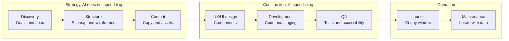
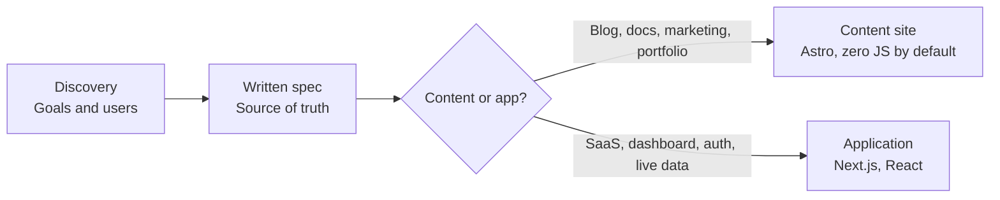
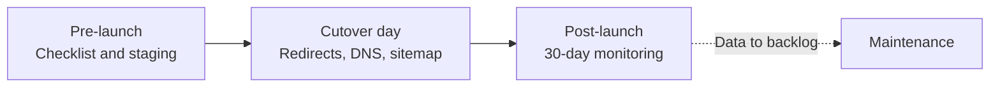

# Website build process

Reference for the process web-lab follows to build a website, from a static site to an app. It
is the base on which the repo's skills and agents are built: each phase has its own skill and
Claude Code acts as orchestrator between them.

## Summary

The process is a sequence of eight phases with an approval checkpoint from Yuno between each
one. What changed in 2026 is the split of time: AI compressed the middle phases, visual design
and code, but discovery and QA take just as long and still decide the quality of the result.

The base practice is *spec-driven development*: phase 1 ends in a written, versioned
specification that is the source of truth. From it come the plan, the tasks and only at the end
the code. "Vibe coding" is left for throwaway prototypes.

## Full flow

Every arrow is a checkpoint: no phase starts without explicit approval. Phases 2 and 3 run in
parallel.

## Phase 1: from the spec to the architecture decision

The spec and the chosen stack feed phases 2 to 8. A hybrid project uses both: marketing on
Astro, product on Next.js.

## Launch window

The launch is not a click. It is a window of about 30 days with prior hardening, cutover day and
post-launch monitoring.

## Phases, deliverables and checkpoints

| # | Phase | Deliverables | Checkpoint | Role |
|---|-------|--------------|------------|------|
| 1 | Discovery | Brief: goals, audience, user tasks, competitors, metrics, constraints. Written spec. Content vs. app decision. | Approve goals, metrics and stack before designing | `cooper` + `schneier` |
| 2 | Structure | Sitemap, page hierarchy, intent per page, wireframes of key templates | Sign off the structure to avoid rework | `rosenfeld` |
| 3 | Content | Messages per page, sections, asset list (photos, video, icons), SEO alignment | Content direction approved before visual design | `rosenfeld` |
| 4 | UX/UI design | Component system, responsive rules, states, documented accessibility, prototype | Design QA including mobile behavior | `frost` |
| 5 | Development | Code with Core Web Vitals in mind, CMS if applicable, content integrated in staging | Staging review: performance, accessibility, content | `osmani`, `hopper` (apps), `bellard` (media) |
| 6 | QA | Functional, browsers and devices, performance, automated and manual accessibility | Test report and verified pre-launch checklist | `beizer` + `schneier` |
| 7 | Launch | Checklist executed, 301 redirect map, analytics validated, sitemap in Search Console | Go-live with Schneier's sign-off | `allspaw` + `schneier` |
| 8 | Maintenance | Maintenance plan, content owner, iteration with data | Periodic review | `allspaw` |

Typical duration: four to six weeks for a small site, eight to thirteen for a marketing site of
ten to fifteen pages with a CMS.

## Minimum standards

- Core Web Vitals: LCP ≤ 2.5 s, INP ≤ 200 ms, CLS ≤ 0.1.
- Accessibility: WCAG 2.2 AA. Automated tools catch only 30 to 40 % of issues; the rest is
  manual review.
- Styling: Tailwind v4 with design tokens. Figma as design source; Code Connect emits React and
  Next.js components.
- Deployment: Vercel or Netlify, on the edge.
- Continuous QA: regression and unit tests run during development, not at the end.

## Roles and security

Each phase has a role in [`agents/`](../agents/) and the orchestrator coordinates them per
[`CLAUDE.md`](../CLAUDE.md). **Schneier**, the security role, reviews at the close of every
phase with the checklist in [`SECURITY.md`](SECURITY.md): a critical finding blocks the phase
and a high one blocks the launch. Skills with procedure and templates are added phase by phase:
[`discovery`](../skills/discovery/SKILL.md) for phase 1,
[`structure`](../skills/structure/SKILL.md) for phase 2,
[`content`](../skills/content/SKILL.md) for phase 3,
[`design-system`](../skills/design-system/SKILL.md) for phase 4,
[`build`](../skills/build/SKILL.md) for phase 5,
[`qa`](../skills/qa/SKILL.md) for phase 6,
[`launch`](../skills/launch/SKILL.md) for phases 7 and 8,
[`security`](../skills/security/SKILL.md) for Schneier's gates in all of them, and
[`optimize-assets`](../skills/optimize-assets/SKILL.md) for media in phases 5 and 6.

## Sources

- [Web Design Agency Process: Discovery to Launch (2026) | Brand Vision](https://www.brandvm.com/post/web-design-agency-2026)
- [The Web Design Process: 8 Essential Steps (2026) | UXPin](https://www.uxpin.com/studio/blog/web-design-process/)
- [Modern Web App Development Process (2026) | Techloy](https://www.techloy.com/modern-web-app-development-process-2026-from-planning-to-ai-driven-deployment/)
- [Web Development Process: 6 Steps (2026) | Webandcrafts](https://webandcrafts.com/blog/website-development-process)
- [The 7-Step Website Development Process (2026) | Digital Silk](https://www.digitalsilk.com/web-development/development-trends/website-development-process/)
- [Web Design Process: What to Expect From an Agency | Brambla](https://www.brambla.co.uk/blog/web-design-process-explained/)
- [Next.js vs. Astro in 2026 | Vercel](https://vercel.com/i/astro-vs-next-js)
- [Astro vs Next.js: Content Sites vs Full-Stack Apps in 2026 | Out Plane](https://outplane.com/blog/astro-vs-nextjs)
- [Complete Web Design Workflow for 2026 | Medium](https://medium.com/@elaissiilyas/complete-web-design-workflow-for-2026-77ab228145ca)
- [Web Development in 2026: Trends, Technologies, and Workflows | Hippotool](https://hippotool.com/web-development-in-2026/)
- [Spec-Driven Development: The Definitive 2026 Guide | BCMS](https://www.thebcms.com/blog/spec-driven-development/)
- [Spec-driven development | Thoughtworks](https://www.thoughtworks.com/en-us/insights/blog/agile-engineering-practices/spec-driven-development-unpacking-2025-new-engineering-practices)
- [Website Launch Checklist: The 2026 Guide | Trajectory](https://www.trajectorywebdesign.com/blog/website-launch-checklist/)
- [Website Launch Checklist 2026: 150+ Items | Digital Applied](https://www.digitalapplied.com/blog/website-launch-checklist-150-items-2026)
- [Website launch checklist: your complete 2026 guide | done.lu](https://done.lu/website-launch-checklist-your-complete-2026-guide/)
