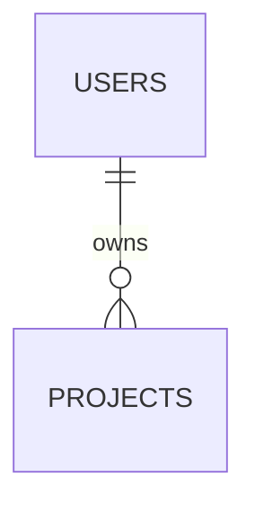

# Backend · [proyecto]

Fecha: [aaaa-mm-dd] · Autora: Hopper · Solo aplicaciones

## Stack

| Qué | Decisión |
|-----|----------|
| Base de datos | Postgres en Neon |
| ORM y migraciones | Drizzle, `drizzle/` |
| Identidad | Clerk / Better Auth / Auth.js |
| Pagos | Stripe / Mercado Pago |
| Rate limiting | Upstash |
| Archivos | Vercel Blob |
| Correo | Resend |

## Modelo de datos



| Tabla | Dueño | Clase de datos | Retención | on delete |
|-------|-------|----------------|-----------|-----------|
| | | pública / interna / personal / sensible | | |

## Permisos

| Recurso | Visitante | Miembro | Admin |
|---------|-----------|---------|-------|
| | | propio | todos |

## Acciones y rutas

| Acción / ruta | Valida | Autoriza | Rate limit | Devuelve | Pruebas |
|---------------|--------|----------|------------|----------|---------|
| | Zod | propiedad | | DTO | feliz / inválido / sin permiso |

## Variables de entorno (nombres, nunca valores)

| Nombre | Para qué | Dónde vive | Quién la rota |
|--------|----------|------------|---------------|
| DATABASE_URL | | Vercel | |

## Migraciones

```bash
pnpm drizzle-kit generate && pnpm drizzle-kit migrate
```

## Backups y restauración

Automático en [proveedor], retención [n] días. Restauración probada el [fecha] en [entorno].

## Deuda y pendientes

| Qué | Por qué | Cuándo |
|-----|---------|--------|
| | | |
