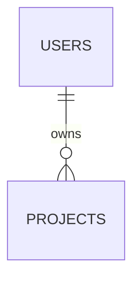

# Backend · [project]

Date: [yyyy-mm-dd] · Author: Hopper · Applications only

## Stack

| What | Decision |
|------|----------|
| Database | Postgres on Neon |
| ORM and migrations | Drizzle, `drizzle/` |
| Identity | Clerk / Better Auth / Auth.js |
| Payments | Stripe / Mercado Pago |
| Rate limiting | Upstash |
| Files | Vercel Blob |
| Email | Resend |

## Data model



| Table | Owner | Data class | Retention | on delete |
|-------|-------|------------|-----------|-----------|
| | | public / internal / personal / sensitive | | |

## Permissions

| Resource | Visitor | Member | Admin |
|----------|---------|--------|-------|
| | | own | all |

## Actions and routes

| Action / route | Validates | Authorizes | Rate limit | Returns | Tests |
|----------------|-----------|------------|------------|---------|-------|
| | Zod | ownership | | DTO | happy / invalid / forbidden |

## Environment variables (names, never values)

| Name | For what | Where it lives | Who rotates it |
|------|----------|----------------|----------------|
| DATABASE_URL | | Vercel | |

## Migrations

```bash
pnpm drizzle-kit generate && pnpm drizzle-kit migrate
```

## Backups and restore

Automatic at [provider], retention [n] days. Restore tested on [date] in [environment].

## Debt and pending

| What | Why | When |
|------|-----|------|
| | | |
