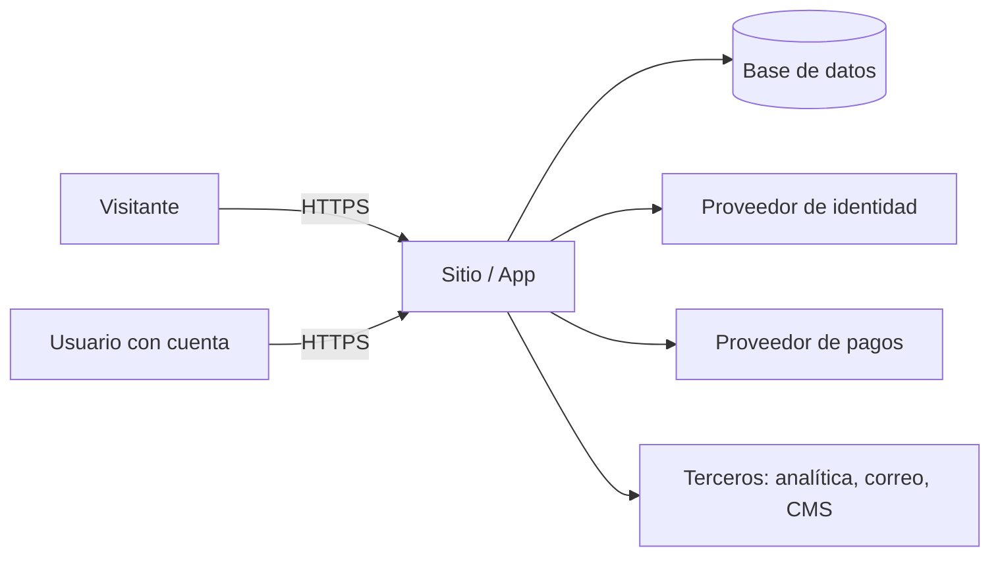

# Modelo de amenazas · [nombre del proyecto]

Fecha: [aaaa-mm-dd] · Autores: Schneier con Cooper · Nivel ASVS objetivo: [1 | 2] · Revisión: [anual o al cambiar alcance]

## 1. ¿Qué estamos construyendo?

[Dos líneas del sistema y sus usuarios.]

### Flujo de datos y fronteras de confianza

Fronteras: [navegador → servidor], [servidor → base de datos], [servidor → terceros], [panel de administración].

### Clasificación de datos

| Dato | Clase | Dónde vive | Quién lo ve | Retención |
|------|-------|------------|-------------|-----------|
| | público, interno, personal, sensible | | | |

### Actores

| Actor | Motivación | Capacidad |
|-------|------------|-----------|
| Visitante anónimo malicioso | | |
| Usuario legítimo curioso | | |
| Competidor | | |
| Bot automatizado | | |
| Persona con acceso interno | | |

## 2. ¿Qué puede salir mal?

STRIDE por cada interacción que cruza una frontera. LINDDUN (vinculación, identificación, no repudio, detección, divulgación, desconocimiento, incumplimiento) si hay datos personales.

| # | Interacción | Categoría | Amenaza en una frase | Probabilidad | Impacto | Riesgo |
|---|-------------|-----------|----------------------|--------------|---------|--------|
| 1 | | S T R I D E | | alta, media, baja | alto, medio, bajo | crítico, alto, medio, bajo |

## 3. ¿Qué vamos a hacer?

| # | Respuesta | Mitigación concreta | Va a la spec como | Dueño | Verificación |
|---|-----------|---------------------|-------------------|-------|--------------|
| 1 | mitigar, eliminar, transferir, aceptar | | RNF-xx | Osmani, Hopper, Allspaw | prueba de Beizer |

## 4. Obligaciones legales

- LFPDPPP (México): aviso de privacidad, derechos ARCO, [aplica | no aplica].
- GDPR (Europa): base legal, consentimiento, derecho al borrado, [aplica | no aplica].
- Sector: [salud, finanzas, menores: qué aplica].

## 5. ¿Lo hicimos bien?

- Revisado contra `docs/SEGURIDAD.md` fase 1: [ ]
- Amenazas sin respuesta: [ninguna]
- Riesgos aceptados y por quién: ver `docs/SEGURIDAD-decisiones.md`
- Veredicto de Schneier: [aprobado | con condiciones | bloqueado] · [razón]
