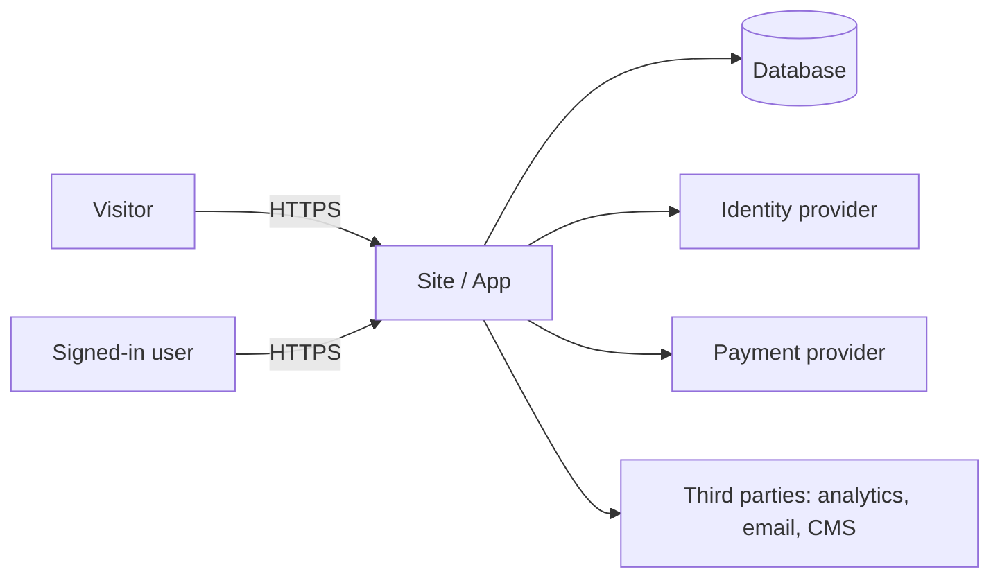

# Threat model · [project name]

Date: [yyyy-mm-dd] · Authors: Schneier with Cooper · Target ASVS level: [1 | 2] · Review: [yearly or when scope changes]

## 1. What are we building?

[Two lines on the system and its users.]

### Data flow and trust boundaries

Boundaries: [browser → server], [server → database], [server → third parties], [admin panel].

### Data classification

| Data | Class | Where it lives | Who sees it | Retention |
|------|-------|----------------|-------------|-----------|
| | public, internal, personal, sensitive | | | |

### Actors

| Actor | Motivation | Capability |
|-------|------------|------------|
| Malicious anonymous visitor | | |
| Curious legitimate user | | |
| Competitor | | |
| Automated bot | | |
| Person with internal access | | |

## 2. What can go wrong?

STRIDE for every interaction that crosses a boundary. LINDDUN (linkability, identifiability,
non-repudiation, detectability, disclosure, unawareness, non-compliance) if there is personal data.

| # | Interaction | Category | Threat in one sentence | Likelihood | Impact | Risk |
|---|-------------|----------|------------------------|------------|--------|------|
| 1 | | S T R I D E | | high, medium, low | high, medium, low | critical, high, medium, low |

## 3. What are we going to do?

| # | Response | Concrete mitigation | Goes to the spec as | Owner | Verification |
|---|----------|---------------------|---------------------|-------|--------------|
| 1 | mitigate, eliminate, transfer, accept | | NFR-xx | Osmani, Hopper, Allspaw | Beizer's test |

## 4. Legal obligations

- Mexico's 2025 LFPDPPP (in force since 21 March 2025; authority: Secretaría Anticorrupción y Buen Gobierno): privacy notice with sensitive data identified, ARCO rights, [applies | does not apply]. See `skills/security/references/legal-mx.md`.
- GDPR (Europe): legal basis, consent, right to erasure, [applies | does not apply].
- Sector: [health, finance, minors: what applies].

## 5. Did we do a good job?

- Reviewed against `docs/SECURITY.md` phase 1: [ ]
- Threats without a response: [none]
- Accepted risks and by whom: see `docs/SECURITY-risks.md`
- Schneier's verdict: [approved | with conditions | blocked] · [reason]
